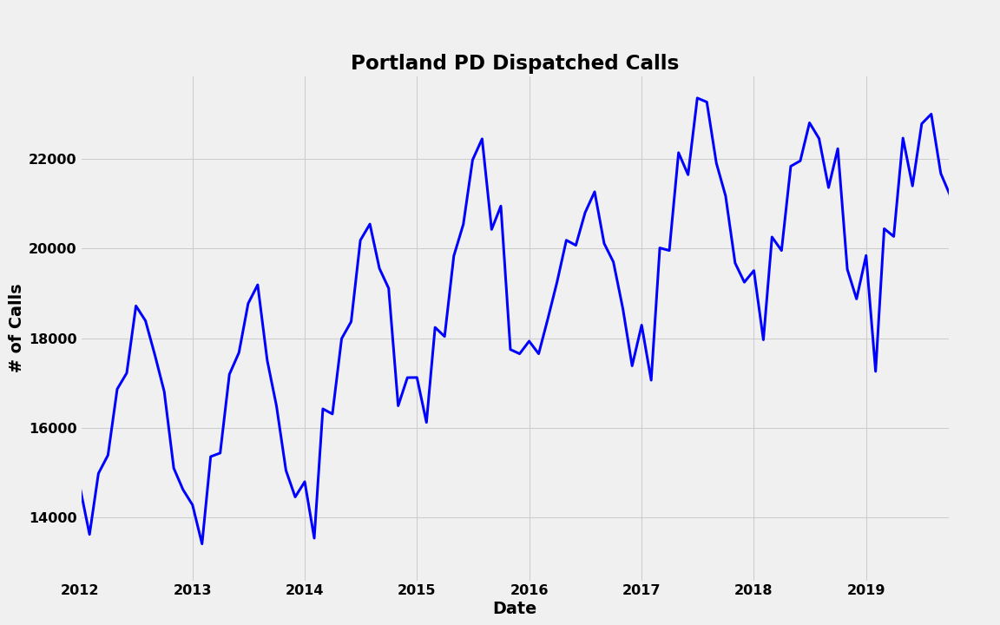
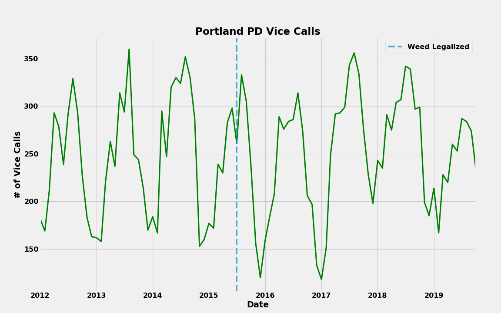

  

# A history of Marijuana Laws in Portland, OR:
**1973 -**  The Oregon Decriminalization Bill made possession of 1 ounce or less a violation (not a crime) punishable by a fine of $500-1000.  
**1986 -** 26 years before Colorado and Washington became the first states to legalize marijuana - an Oregon Bill sought to legalize marijuana in Oregon.  It failed to pass with only 26.33% support from voters.  
**1997 -** House Bill 3643 was passed and recriminalized possession of less than an ounce to a Class C misdemeanor.
 **2012 -** A bill proposing to legalize marijuana failed to pass by a margin of 53% against - 47% for.
 **November 1st, 2014 -** Oregon became the 5th state to pass legislation to legalize recreational use of marijuana and allow for state-controlled sale of cannabis. 
 **July 1st, 2015 -** The legalization of marijuana in Oregon officially takes effect.
 **October 1st, 2015 -** Governor Kate Brown signed an emergency bill declaring marijuana sales legal to recreational consumers (Paris, Achen)

## Data Sources
While searching for datasets I came across the ["Police Data Initative"](https://www.policedatainitiative.org/).  This initiative:
*
"promotes the use of open data to encourage joint problem solving, innovation, enhanced understanding, and accountability   between communities and the law enforcement agencies that serve them." (https://www.policedatainitiative.org/) 
* 

Over 130 US Police Agencies have voluntarily joined the Initiative and release datasets that summarize some of their activities.  Searching the data-sets of these 130 Agencies reveals that some Agencies are much more thorough in their compilation and release of data than others.  Portland PD is particularly generous with their information and releases [data-sets](https://www.portlandoregon.gov/police/71673) pertaining to Dispatched Calls, Traffic Stops, Uses of Force, Officer Involved Shootings, Traffic Stops, and others.  Portland PD was also of particular interest due to the recent legalization of marijuana and its' potential impact on crime trends.  

## Data Pipeline
This study pertains to the Dispatched Calls data-set which contains 7 csv files each containing roughly 30,000 rows and 14 columns - with each row representing one dispatched police call.  The columns include values for lat and long, call category ('Vice', 'Assault', 'Community Assist', etc...), response time, priority, neighborhood, and month of call.  

In order to plot this data delineated by Portland Neighborhoods, the GeoJSON data from ["PortlandMaps - Open Data"](https://gis-pdx.opendata.arcgis.com/datasets/neighborhoods-regions/data) was also utilized.  This data provided polygonal information of Portland's neighborhood barriers.

The Dispatched Calls Data-set was extremely clean.  As a result, the primary purpose of the pipeline was to join the 7 yearly csv files and select appropriate fill values for the rare nulls in each field.  After loading the Portland neighborhood GeoJSON, it was apparent that many neighborhood names differed between the neighborhood field of the Police Data and the official Neighborhood name as published by the city.  This required a correction of the Police Data to match the GeoJSON neighborhood fields.

## Data Analysis
The primary focus of early data analysis was to determine if there were any significant impacts of the legalization of marijuana on criminal trends.  The key date of trend analysis is July 1st, 2015 - the day that the legalization bill came into effect.  To begin it was useful to get an understanding of how many Oregonians regularly use marijuana.  Since the early 2000's, surveys maintained by the Drug Enforcement Administration and the National Organization for the Reform of Marijuana Laws show that the rate of Oregon citizens who use cannabis is between 30-40% higher than the national average.  Oregon ranks in the top 20th percentile for marijuana use in several different age ranges (DEA, Portland Business Journal, NORML).  According to the Oregon Health Authority, 19% of all adults and 31% of adults age 18-24 regularly use marijuana.  This compares to 11% and 18% in 2014, respectively (OHA).

## Number of Calls Dispatched for Drug-related Offenses

  

First a view of the total number of Dispatched Calls in Portland from the date range of the data set, January 2012 to September 2019.

  

Portland categorizes drug-related calls under the "Vice" category.  Note that the overall number of Vice calls stays relatively constant over time while the overall number of calls increases.

  

To better analyze how Vice Crimes have changed over time, here they are represented as a ratio of total calls.

## Vice Crimes Location Over Time

  

To begin, an interactive clustered map is created to visualize Vice Crimes throughout the city (html file located in images folder, it can be downloaded and run on a local machine).

### Maybe Useful...

Further analysis could combine many of these data-sets to identify trends across data-sets.  This study pertains to the Dispatched Calls data-set which contains 7 csv files each containing roughly 30,000 rows and 14 columns - with each row representing one dispatched police call.  The columns include values for lat and long, call category ('Vice', 'Assault', 'Community Assist', etc...), response time, priority, and neighborhood.

width="460" height="300"

# References
https://en.wikipedia.org/wiki/Cannabis_in_Oregon#Legal_history
 
"Oregon Marijuana Statistics". National Organization for the Reform of Marijuana Laws. 2008-12-05. Archived from the original on April 15, 2008. Retrieved 2008-12-17.

"Oregon marijuana use among highest in U.S." Portland Business Journal. 2006-04-06. Archived from the original on 2008-02-25. Retrieved 2008-12-17.

"DEA Briefs and Background, Drugs and Drug Abuse, State Factsheets, Oregon". Drug Enforcement Administration. Archived from the original on August 22, 2008. Retrieved 2008-12-18.

Aachen, Paris (March 30, 2016). "New marijuana law clears way for recreational, medical sales in same place". Portland Tribune. Archived from the original on February 11, 2017. Retrieved 2017-02-08.

https://www.policedatainitiative.org/

https://gis-pdx.opendata.arcgis.com/datasets/neighborhoods-regions/data

Oregon Health Authority
https://www.oregon.gov/oha/PH/PREVENTIONWELLNESS/MARIJUANA/Documents/fact-sheet-marijuana-adults.pdf