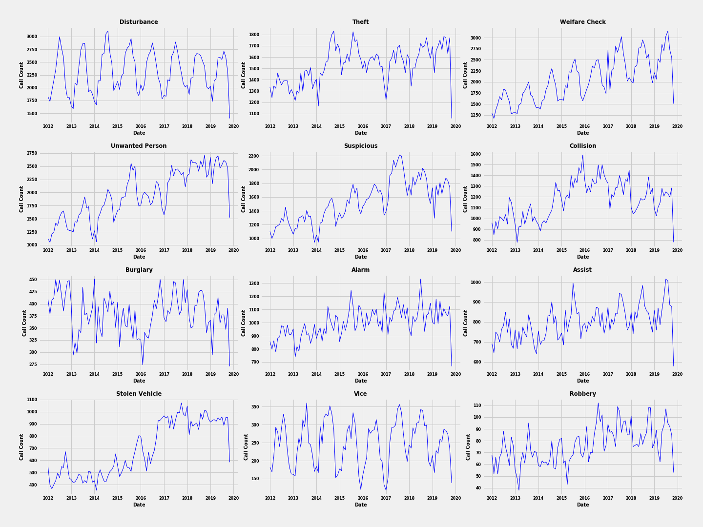
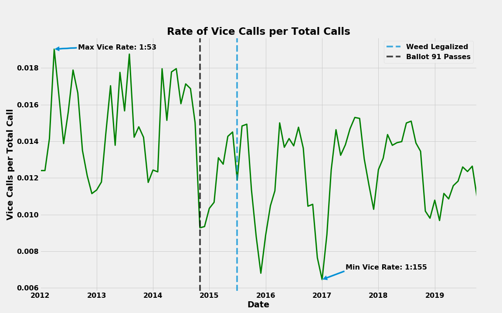

  

# Portland, Oregon - How Weird is too Weird?
The city of Portland has a unique culture even amongst the liberal cities of the Pacific Northwest.  The recent decades have taken Portland from a shipping port with more strip clubs per capita than anywhere else in the United States to a crunchy-hipster mecca that still has more strip clubs per capita than anywhere else in the United States - some of which are fully vegan.  Portlanders take immense pride in their freedom of speech, self-expression, exquisite coffee, quirky hats and piercings, and glasses that curiously lack any lenses.  Recently Portland has become more widely known for it's culture and hyper-liberal ways.  Has this proliferation of Portland culture caused a shift in the crime patterns in the city?  Has the 2015 legalization of marijuana significantly effected the types or rates of crime in the city?

## Table of Contents
1. [A history of Marijuana Laws in Portland, OR](#marijuana_law)
2. [Data Sources](#data_sources)
3. [Data Pipeline](#data_pipeline)
4. [Data Analyis](#data_analysis)
5. [Number of Calls Dispatched for Drug-related Offenses](#drug_calls)
6. [Vice Crimes Location Over Time](#vice_over_time)
7. [References](#references)

## A history of Marijuana Laws in Portland, OR :
**1973 -**  Oregon became the first state to decriminalize marijuana.  The Oregon Decriminalization Bill made possession of 1 ounce or less a violation (not a crime) punishable by a fine of $500-1000.  
**1986 -** 26 years before Colorado and Washington became the first states to legalize marijuana - an Oregon Bill sought to legalize marijuana in Oregon.  It failed to pass with only 26.33% support from voters.  
**1997 -** House Bill 3643 was passed and recriminalized possession of less than an ounce to a Class C misdemeanor.
 **2012 -** A bill proposing to legalize marijuana failed to pass by a margin of 53% against - 47% for.
 **November 1st, 2014 -** Oregon became the 5th state to pass legislation to legalize recreational use of marijuana and allow for state-controlled sale of cannabis. 
 **July 1st, 2015 -** The legalization of marijuana in Oregon officially takes effect.
 **October 1st, 2015 -** Governor Kate Brown signed an emergency bill declaring marijuana sales legal to recreational consumers (Paris, Achen)

## Data Sources 
Data used for this analysis was sourced from the ["Police Data Initative"](https://www.policedatainitiative.org/).  This initiative:

*
 "promotes the use of open data to encourage joint problem solving, innovation, enhanced understanding, and accountability between communities and the law enforcement agencies that serve them." (https://www.policedatainitiative.org/) 
* 

Over 130 US Police Agencies have voluntarily joined the Initiative and release datasets that summarize some of their activities.  Searching the data-sets of these 130 Agencies reveals that some Agencies are much more thorough in their compilation and release of data than others.  Portland PD is particularly generous with their information and releases [data-sets](https://www.portlandoregon.gov/police/71673) pertaining to Dispatched Calls, Traffic Stops, Uses of Force, Officer Involved Shootings, Traffic Stops, and others.  Portland PD was also of particular interest due to the recent legalization of marijuana and its' potential impact on crime trends.  

In addition to using the Dispatched Call Data, GeoJSON Neighborhood delineation data was acquired from ["PortlandMaps - Open Data"](https://gis-pdx.opendata.arcgis.com/datasets/neighborhoods-regions/data).  This data provided polygonal information of Portland's neighborhood barriers.  As seen in the Data Pipeline, the neighborhood titles in Portland PD data and Portland Open neighborhood data often did not match.

## Data Pipeline 
This study pertains to the "Dispatched Calls" data-set from the Portland PD which contains 7 .csv files each containing 14 columns.  When combined, the datasets contained approximately 1.8 million rows - with each row representing one dispatched police call.  Dispatch data ranged from January 2012 to November 2019.  Select columns are shown below:

| Column | Description |
|---|---|
| FinalCallCategory  | Type of Call (Assault, Vice, Suspicious Person, Traffic, etc...)  |
| OpenDataLat | Latitude (deg) |
| OpenDataLong | Longitude (deg) |
| ReponseTime | Time from Call to Officer on Location (secs) |
| Priority | High, Medium, Low |
| ReportMonthYear | String Containing Year, Month, Day |
| Neighborhood | ('Portland Downtown', 'Ft. Hood', 'Harborview', 'East Lake', etc...) |

The Dispatched Calls Data-set was extremely clean.  As a result, the primary purpose of the pipeline was to join the 7 yearly csv files and select appropriate fill values for the rare nulls in each field.  After parsing the Portland neighborhood GeoJSON, it became apparent that many neighborhood names differed between the neighborhood field of the Police Data and the official Neighborhood name as published by the city.  This required a correction of the Police Data to match the GeoJSON neighborhood fields.  

## Data Analysis 
While the primary focus of this project was to determine if there were any significant impacts of the legalization of marijuana on criminal trends, initial data exploration was performed to gain an understanding of what call types are most frequent and when/where they peaked - beginning with an analysis of total dispatched calls over the entire date range of the data set.

  

It was immediately apparent that Portland experienced significant seasonal crime variation.  In addition, total calls had risen over time, out-pacing the 8%% population growth from seen from 2012 to 2018 (opendatainitiative.org).  The top 12 most common call types were selected and mapped over the same time frame.  To account for the increasing trend in the number of total calls, the second graph normalizes the 12 most common call types into call rates by dividing the count of category call types by the total number of calls.

 

  

 

  

In the normalization graph there are several interesting trends.  Firstly, there is a spike in "Welfare Check" calls in the winter of 2017.  Winter storm Jupiter in December 2016 was the cities heaviest snowstorm since February 1995 (Edman).  This storm may also be responsible for the spike in "Alarm" calls in the same timeframe.  Normalized "Collision" call rates also reach all-time highs in late 2016, the same time that marijuana first became legal to sell in Oregon (October 2015).  Stolen Vehicle rates begin to increase 2015 and remain elevated for the duration of the data.  Finally, "Vice" crimes (Portland PD defines "Vice" as calls involving drugs or prostitution), drop in late 2014 and remain at lower rates thru 2019.  The bill to legalize marijuana was passed in November of 2014 and came into effect July 1st 2015.  Vice rates appear to be effected by these dates.  

Accordingly, it was useful to get an understanding of how many Oregonians regularly use marijuana.  Since the early 2000's, surveys maintained by the Drug Enforcement Administration and the National Organization for the Reform of Marijuana Laws show that the rate of Oregon citizens who use cannabis is between 30-40% higher than the national average (DEA, NORML).  Oregon ranks in the top 20th percentile for marijuana use in several different age ranges.  According to the Oregon Health Authority, 19% of all adults and 31% of adults age 18-24 regularly use marijuana.  This compares to 11% and 18% in 2014, respectively (OHA).

## Number of Calls Dispatched for Drug-related Offenses 
Recall the overall distribution of dispatched calls over time:

  

This illustrates the distribution of calls pertaining to the "Vice" Call Category.  It is important to note that the overall number of Vice calls stays relatively constant over time while the overall number of calls increases.

  

In order to analyze the rate of Vice calls, the Vice calls were normalized to be shown as a rate of calls per total calls.  The decrease in average rates before and after marijuana legalization is approximately 26%.  

  

## Vice Crimes Location Over Time 
Has there been a shift in Vice "hotspots" over time?  Do Vice calls follow the same neighborhood distribution as total calls?  To begin, an interactive clustered map is created to visualize Vice Crimes throughout the city (.html file is located in the images folder, it can be downloaded and run on a local machine).

  

Next a count of dispatched calls delineated by neighborhood was created.  This is a count of dispatched calls to each Portland neighborhood ranging from January 2012 thru November 2019.

  

  

And for the same time frame, the distribution of Vice crimes delineated by neighborhood is shown above.  It appears that Portsmouth and Saint Johns have higher Vice activity per capita compared to the rest of Portland.  Further analysis is needed in order to confirm statistical significance.

### References 
"Oregon Marijuana Statistics". National Organization for the Reform of Marijuana Laws. 2008-12-05. Archived from the original on April 15, 2008. Retrieved 2008-12-17.

"Oregon marijuana use among highest in U.S." Portland Business Journal. 2006-04-06. Archived from the original on 2008-02-25. Retrieved 2008-12-17.

"DEA Briefs and Background, Drugs and Drug Abuse, State Factsheets, Oregon". Drug Enforcement Administration. Archived from the original on August 22, 2008. Retrieved 2008-12-18.

Aachen, Paris (March 30, 2016). "New marijuana law clears way for recreational, medical sales in same place". Portland Tribune. Archived from the original on February 11, 2017. Retrieved 2017-02-08.

https://en.wikipedia.org/wiki/Cannabis_in_Oregon#Legal_history
 
https://www.policedatainitiative.org/

https://gis-pdx.opendata.arcgis.com/datasets/neighborhoods-regions/data

Oregon Health Authority
https://www.oregon.gov/oha/PH/PREVENTIONWELLNESS/MARIJUANA/Documents/fact-sheet-marijuana-adults.pdf

https://www.opendatanetwork.com/entity/1600000US4159000/Portland_OR/demographics.population.change?year=2017

Jon Erdman - https://weather.com/storms/winter/news/portland-oregon-worst-winter-city-2016-2017
